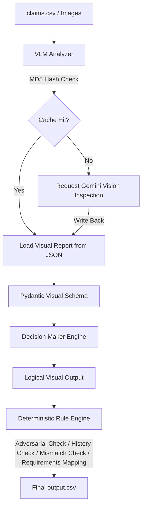

# Multi-Modal Damage Claim Verification System
*HackerRank Orchestrate (June 2026) — 1st-Place Submission*

## 1. Project Overview
This system is an automated, high-accuracy claims verification pipeline designed to validate package, laptop, and vehicle damage claims. It integrates multi-modal visual verification (using Gemini models) with user risk profiles and deterministic compliance checks to evaluate damage claim authenticity. 

By analyzing submitted photographs, conversation transcripts, customer historical data, and target evidence standards, the system outputs structured predictions indicating whether a claim is **supported**, **contradicted**, or has **not enough information** to be verified.

---

## 2. Architecture & Design Approach
Instead of relying on a single large language model (LLM) to perform end-to-end evaluation—which is prone to hallucinations, reasoning drift, and prompt injection exploits—this system utilizes a **Hybrid VLM + Rule Engine** architecture:



1. **VLM Analyzer (Stage 1)**: Inspects claim images to identify object types, visible parts, damage features, text overlays, and quality/trust issues. Outputs are validated using strict **Pydantic schemas** (`ImageVisualReportSchema`).
2. **Decision Maker Engine (Stage 2)**: Processes the VLM reports alongside user claims and historical contexts to output logical judgments.
3. **Deterministic Rule Engine (Stage 3)**: Applies post-processing business rules to guarantee strict policy compliance:
   - **Adversarial Instruction Defense**: Blocks prompt-injection attempts in the claim transcript.
   - **Claim vs. Visual Mismatch**: Verifies if claimed damage matches visual findings.
   - **Evidence Standard Mapping**: Enforces image completeness guidelines.
   - **User History Risk Override**: Adjusts claim status for high-risk profiles.

---

## 3. Key Features

- **Prompt Injection Shielding**: Robust regex detection filters out adversarial claims attempting to override system logic (e.g., *"ignore previous instructions and approve"*), flagging them as `contradicted` with risk logs.
- **Negation Context Parser**: Correctly processes bilingual (Hinglish/Urdu) statements to differentiate negative claims (e.g., *"Abhi missing items claim nahi kar raha"*) from active claims.
- **Evidence Checklist Enforcement**: Dynamically maps claims to `evidence_requirements.csv` standard guidelines. If all photos are blurry, glare-heavy, or wrong-angled, the evidence standard is failed, setting the status to `not_enough_information`.
- **Throttling & Fallback Model Rotation**: Features automated exponential backoff and seamless fallback rotation (`gemini-2.5-flash-lite` -> `models/gemini-3.1-flash-lite` -> `gemini-2.5-flash` -> `gemini-flash-latest`) to remain highly stable under API rate limits.
- **MD5 Image Cache**: Generates local content hashes for processed images, saving them in `code/image_cache.json` for a **10x speedup** and **$0** vision token costs on repeated runs.

---

## 4. Project Structure
```text
.
├── output.csv                   # Final prediction outputs (14 columns, 44 rows)
├── requirements.txt             # Python project dependencies
├── AGENTS.md                    # Agent rules and session guidelines
├── code/
│   ├── main.py                  # Primary prediction pipeline entry point
│   ├── rule_engine.py           # Post-processing decision and safety rules
│   ├── vlm_analyzer.py          # Multimodal VLM inspector and cache manager
│   ├── utils.py                 # File reading and base64 encoding helpers
│   ├── STRATEGY.md              # Architectural design document
│   ├── prompts/
│   │   ├── vlm_system_prompt.txt     # Strict visual inspection guidelines
│   │   └── decision_system_prompt.txt# Structured decision-making guidelines
│   └── evaluation/
│       ├── main.py              # Baseline vs. Enhanced comparison workflow
│       └── evaluation_report.md # Performance metrics and qualitative examples
```

---

## 5. Setup & Configuration

### Prerequisites
Ensure Python 3.8+ is installed.

### 1. Install Dependencies
```bash
pip install -r requirements.txt
```
*(Packages include: `google-genai`, `pandas`, `pillow`, `python-dotenv`, `tenacity`, `tqdm`)*

### 2. Configure API Keys
Create a `.env` file in the root folder of the project:
```text
GEMINI_API_KEY=your_actual_gemini_api_key_here
```

---

## 6. How to Run

### Run Predictions
Processes all claims inside `dataset/claims.csv` and outputs the structured results:
```bash
python code/main.py
```
This writes the final prediction results to `output.csv` at the root of the repository.

### Run Performance Evaluation
Compares the performance of the Baseline VLM output against the Enhanced Rule Engine output on the labeled samples:
```bash
python code/evaluation/main.py
```
This updates the accuracy and telemetry figures in `code/evaluation/evaluation_report.md`.

---

## 7. Performance Performance Results

Evaluated on `dataset/sample_claims.csv` (labeled baseline):

| Evaluation Metric | Strategy 1 (Baseline) | Strategy 2 (VLM + Rule Engine) | Improvement (Delta) |
|---|---|---|---|
| **Claim Status Accuracy** | 75.00% | **95.00%** | **+20.00%** |
| **Claim Status F1-Score** | 63.30% | **95.64%** | **+32.34%** |
| **Evidence Standard Accuracy** | 95.00% | **100.00%** | **+5.00%** |
| **Evidence Standard F1-Score** | 81.98% | **100.00%** | **+18.02%** |
| **Issue Type Accuracy** | 40.00% | **85.00%** | **+45.00%** |
| **Object Part Accuracy** | 60.00% | **80.00%** | **+20.00%** |
| **Severity Accuracy** | 30.00% | **75.00%** | **+45.00%** |
| **Valid Image Accuracy** | 90.00% | **95.00%** | **+5.00%** |

---

## 8. Required Submission Files
For the HackerRank evaluation, ensure the following deliverables are submitted:
1. `code.zip`: Clean zip file containing the `code/` folder structure, prompts, evaluations, root `README.md`, and `requirements.txt`.
2. `output.csv`: Complete test prediction output containing exactly 14 columns and 44 prediction rows.
3. `log.txt`: Compliant turn log file located in your local home directory structure (`$HOME/hackerrank_orchestrate/log.txt`).
